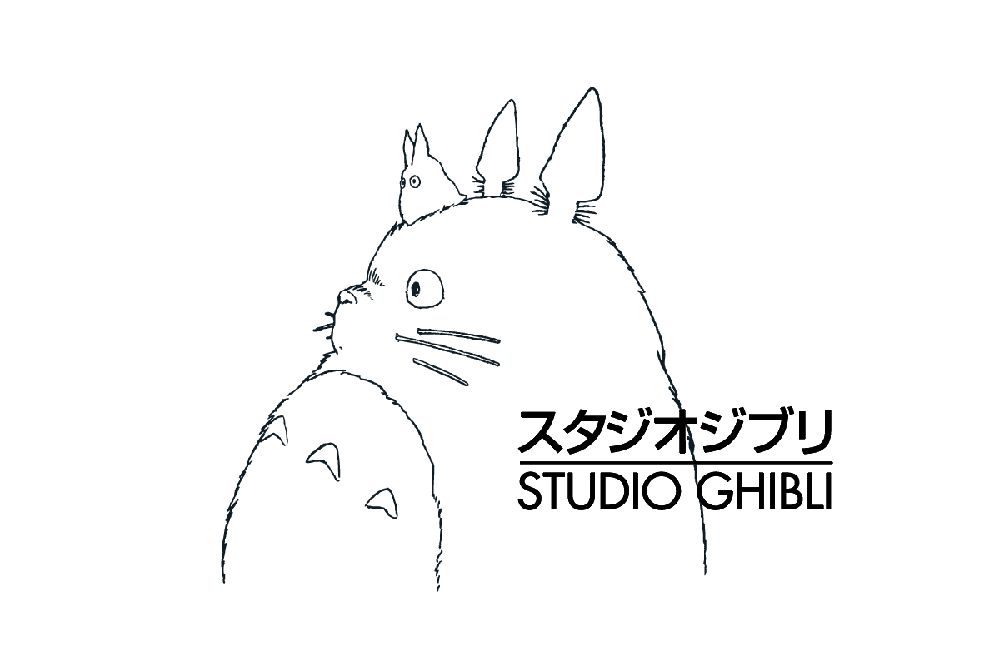

<a name="readme-top">

<br/>

<br />
<div align="center">
  <a href="https://github.com/Eysee3/">
  <!-- TODO: If you want to add logo or banner you can add it here -->
    
  </a>
<!-- TODO: Change Title to the name of the title of your Project -->
  <h3 align="center">Headers and Footers</h3>
</div>
<!-- TODO: Make a short description -->
<div align="center">
  Website that has a variety of designs for headers and footers, both static and animated.
</div>

<br />

<!-- TODO: Change the zyx-0314 into your github username  -->
<!-- TODO: Change the WD-Template-Project into the same name of your folder -->


---

<br />
<br />

<!-- TODO: If you want to add more layers for your readme -->
<details>
  <summary>Table of Contents</summary>
  <ol>
    <li>
      <a href="#overview">Overview</a>
      <ol>
        <li>
          <a href="#key-components">Key Components</a>
        </li>
        <li>
          <a href="#technology">Technology</a>
        </li>
      </ol>
    </li>
    <li>
      <a href="#rule,-practices-and-principles">Rules, Practices and Principles</a>
    </li>
    <li>
      <a href="#resources">Resources</a>
    </li>
  </ol>
</details>

---

## Overview

<!-- TODO: To be changed -->
<!-- The following are just sample -->
Description of the project in details.

Guiding Question:
- What is the project? Making of Static and Animated Headers and Footers
- Whats the purpose? To see the capabilities of students in  creating headers and footers
- What are key components? Various designs and animations for both headers and footers, having functioning buttons and search bars.
- What technology used and how it is used? Html & CSS


### Key Components
<!-- TODO: List of Key Components -->
<!-- The following are just sample -->
- MultiPage Website
- Landing Page with Animations
- Static and Animated Headers
- Static and Animated Footers

### Technology
<!-- TODO: List of Technology Used -->


## Rules, Practices and Principles
1. Always use `WD-` in the front of the Title of the Project for the Subject followed by your custom naming.
2. Do not rename any .html files; always use `index.html` as the filename.
3. Place Files in their respective folders.
4. All file naming are in camel case.
   - Camel case is naming format where there is no white space in separation of each words, the first word is in all lower case while the succeding words first letter are in upper followed by lower cased letters.
   - ex.: buttonAnimatedStyle.css
5. Use only `External CSS`.
6. Renaming of Pages folder names are a must, and relates to what it is doing or data it holding.
7. File Structure to follow below.

```
WD-ProjectName
└─ assets
|   └─ css
|   |   └─ style.css
|   └─ img
|   |   └─ fileWith.jpeg/.jpg/.webp/.png
|   └─ js
|       └─ script.js
└─ pages
|  └─ pageName
|     └─ assets
|     |  └─ css
|     |  |  └─ style.css
|     |  └─ img
|     |  |  └─ fileWith.jpeg/.jpg/.webp/.png
|     |  └─ js
|     |     └─ script.js
|     └─ index.html
└─ index.html
└─ readme.md
```

## Resources

<!-- TODO: Add References -->
| Title | Purpose | Link |
|-|-|-|
| Howl Castle | Center Piece | https://www.pngegg.com/en/png-parmf |
| Studio Ghibli | Logo | https://upload.wikimedia.org/wikipedia/en/thumb/c/ca/Studio_Ghibli_logo.svg/1200px-Studio_Ghibli_logo.svg.png|
| Search bar| Search Bar | https://codepen.io/dashbouquetdevelopment/pen/eGxQRO|
|Social Media Buttons|Socials|https://www.w3schools.com/howto/tryit.asp?filename=tryhow_css_social_media_buttons2|
| Header 1 Layout | Layout | https://lilypichu.com/|
| Header 2 Layout | Layout | https://smtickets.com/|
| Header 3 Layout | Layout | https://www.acdc.com/tour/|
|Header 4 Layout|Layout|https://viveresalon.com/|
|Header 5 Layout|Layout|https://www.pandptattoo.com/gallery|
|Dynamic Logo Header 5 animation| Glow Effect when Hovered| https://codepen.io/rhenaldkarrel-the-bold/pen/OJxabbB|
|Footer 1 layout| Layout| https://artistree.io/ |
|Footer 2 layout| Layout| https://www.bandsintown.com/c/manila-philippines |
|Footer 3 layout| Layout| https://ghost-official.com/ |
|Footer 4 layout| Layout| https://www.davidsalon.com.ph/ |
|Footer 2 Nav Links | Animation| https://codepen.io/lynnewritescode/pen/zMmyJW|
